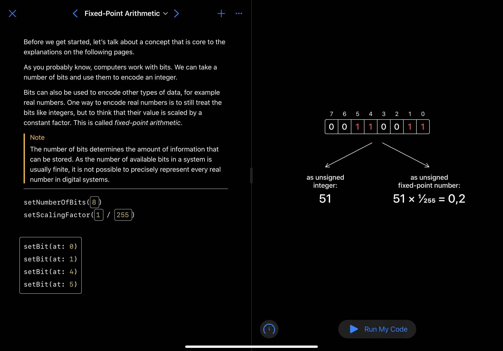
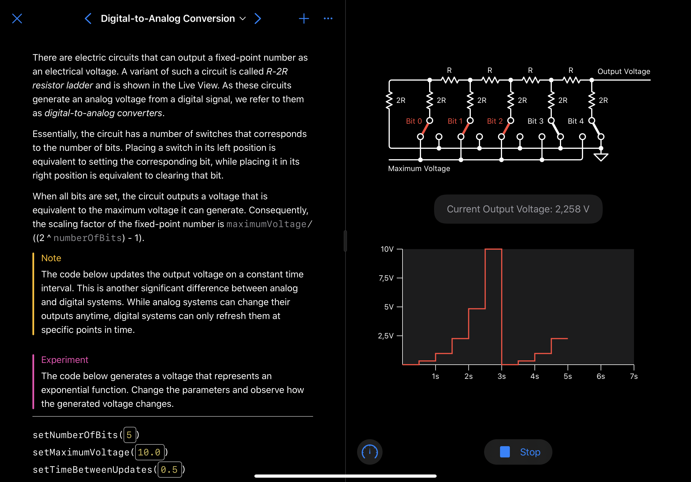
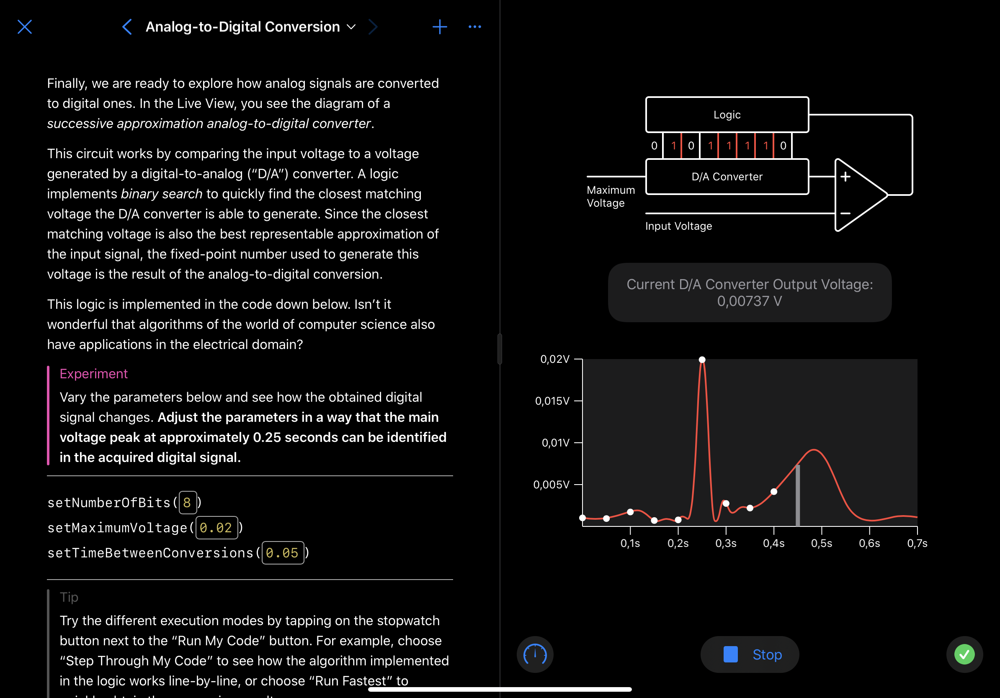

# Analog-to-Digital Conversion Playground

This playground aims to explain the process of converting analog signals to digital ones. When a device such as Apple Watch takes an ECG (or simply measures the temperature), it does so by measuring an electrical voltage. Since CPUs are digital circuits, the voltage needs to be converted to a digital signal before it can be processed inside the CPU.

There are multiple approaches to analog-to-digital conversion. The presented approach (successive approximation) depends on the conversion of digital signals to analog voltages. Consequently, digital-to-analog conversion is also discussed in this playground.

